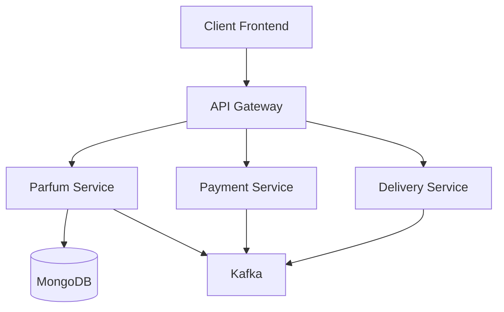
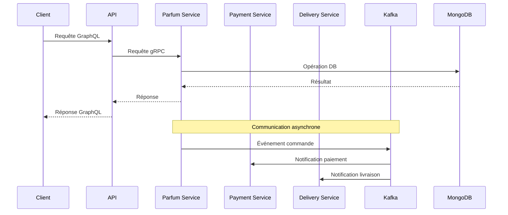
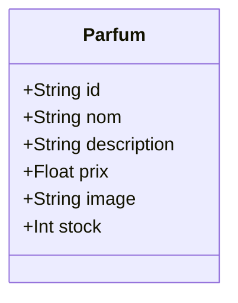
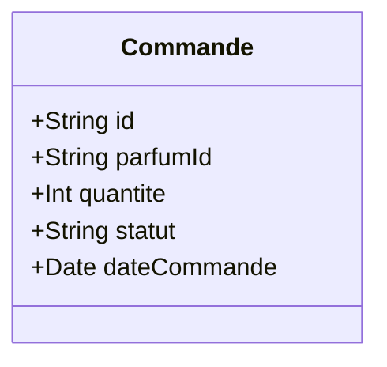

# Système de Gestion de Parfums - Architecture Microservices

## Table des matières
- [Vue d'ensemble](#vue-densemble)
- [Architecture](#architecture)
- [Services](#services)
- [Technologies utilisées](#technologies-utilisées)
- [Installation et démarrage](#installation-et-démarrage)
- [API Documentation](#api-documentation)

## Vue d'ensemble

Ce projet est une application de gestion de parfums basée sur une architecture microservices. Il comprend plusieurs services qui communiquent entre eux via gRPC et Kafka pour la gestion des événements.

## Architecture



## Services

### 1. API Gateway (Port: 3001)
- Point d'entrée unique pour toutes les requêtes client
- Gère le routage vers les différents microservices
- Implémente la logique de résolution GraphQL

### 2. Service Parfum (Ports: 50053, 3003)
- Gestion du catalogue de parfums
- Opérations CRUD sur les parfums
- Stockage des données dans MongoDB

### 3. Service de Paiement (Port: 50054)
- Gestion des transactions de paiement
- Communication asynchrone via Kafka
- Traitement des commandes de paiement

### 4. Service de Livraison (Port: 50055)
- Gestion des livraisons
- Communication asynchrone via Kafka
- Suivi des commandes de livraison

## Technologies utilisées

- **Backend:**
  - Node.js
  - gRPC
  - MongoDB
  - Kafka
  - Docker

- **Frontend:**
  - React.js
  - GraphQL

## Installation et démarrage

1. Prérequis:
   - Docker
   - Docker Compose
   - Node.js (v14+)

2. Cloner le repository:
```bash
git clone [URL_DU_REPO]
cd mini_projet
```

3. Démarrer les services:
```bash
docker-compose up -d
```

Les services seront disponibles aux ports suivants:
- Frontend: http://localhost:3000
- API Gateway: http://localhost:3001
- Service Parfum: http://localhost:3003
- MongoDB: localhost:27017
- Kafka: localhost:9092

## Diagramme de séquence



## Structure des données

### Parfum


### Commande


## Sécurité et Performance

- Communication inter-services sécurisée via gRPC
- Gestion asynchrone des événements avec Kafka
- Stockage persistant avec MongoDB
- Mise en conteneur avec Docker pour une déploiement facile

## Monitoring et Logging

Les services sont configurés pour:
- Logger les événements importants
- Tracer les requêtes entre services
- Monitorer les performances

## Contribution

Pour contribuer au projet:
1. Fork le repository
2. Créer une branche pour votre fonctionnalité
3. Soumettre une pull request

## Licence

[Spécifier la licence] 